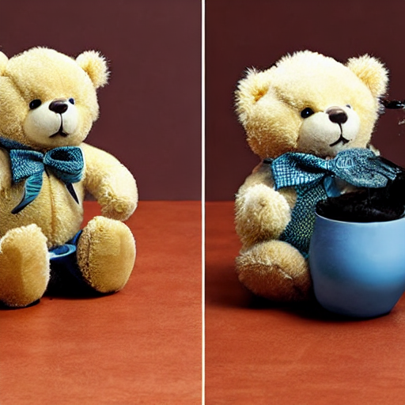

# reground
This is an unofficial re-implementation of paper "ReGround: Improving Textual and Spatial Grounding at No Cost" published in ECCV 2024. The code is modified on top of [GLIGEN](https://github.com/gligen/GLIGEN). Note we only test on the Generation task with Box+Text modalities. Other tasks and modalities would follow a similar procedure.

# installation
1. Create your Python environment.

2. Install your favorite PyTorch with your hardware.

3. Install libraries.
```
pip install requirements.txt
```

4. Download a checkpoint from [huggingface](https://huggingface.co/gligen/gligen-generation-text-box/blob/main/diffusion_pytorch_model.bin), rename ```diffusion_pytorch_model.bin``` to ```checkpoint_generation_text.pth```, and place it into a new folder ```./gligen_checkpoints```.

# reground modification
Theoretically from the paper, we can form the re-wiring operation for gated self-attention while inserting the controlling factor ```beta_t``` to the gated self-attention. It can be implemented in the following lines in ```ldm/modules/attention.py```.
```python
def forward(self, x, context, objs):
#    return checkpoint(self._forward, (x, context, objs), self.parameters(), self.use_checkpoint)
    if self.use_checkpoint and x.requires_grad:
        return checkpoint.checkpoint(self._forward, x, context, objs)
    else:
        return self._forward(x, context, objs)
```
can be replaced with
```python
def forward(self, x, context, objs):
#    return checkpoint(self._forward_reground, (x, context, objs), self.parameters(), self.use_checkpoint)
    if self.use_checkpoint and x.requires_grad:
        return checkpoint.checkpoint(self._forward_reground, x, context, objs, beta_t)
    else:
        return self._forward_reground(x, context, objs, beta_t)
```

Scaling hyperparameter $\beta_t$ for gated self-attention is implemented in ```ldm/models/diffusion/plms.py``` as follows.
```python
# gated self-attention control
if i <= rho * total_steps:
    beta_t = 1.0
else:
    beta_t = 0.0
```

# inference
Run the below command.
```
python gligen_inference.py --rho 0.3
```

# results
Prompt = "a teddy bear blowing smoke sitting next to a bird".

Bounding boxes = [0.0,0.09,0.33,0.76], [0.55,0.11,1.0,0.8].

Phrases = ["a teddy bear", "a bird"].

## Stable Diffusion
<p float="left">
  
  
  
  
  
</p>

## GLIGEN
<p float="left">
  
  
  
  
  
</p>

## REGROUND with scheduling parameter $\rho=0.1$
<p float="left">
  
  
  
  
  
</p>

## REGROUND with scheduling parameter $\rho=0.146875$
<p float="left">
  
  
  
  
  
</p>